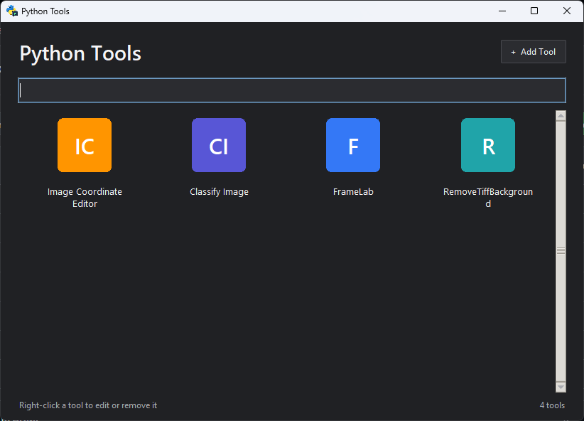
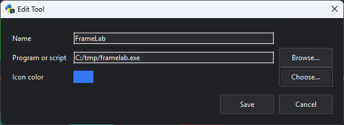
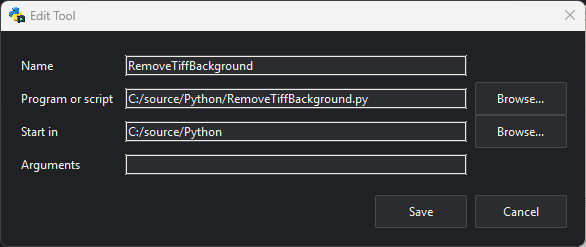

# Python Tools Launcher

A Windows launcher that presents local executables and Python scripts as a
responsive home-screen grid.
It follows the Windows light/dark app theme and stores its tool list at:



```text
%LOCALAPPDATA%\PythonToolLauncher\tools.json
```

## Run from source

```powershell
py -3.14 -m venv .venv
.\.venv\Scripts\python.exe -m pip install -e ".[build]"
.\.venv\Scripts\python-tools.exe
```

## Build the standalone executable

```powershell
.\build.ps1
```

The finished application is written to `dist\PythonTools.exe`. The Windows executable
icon comes from `assets\launcher-icon.ico`; the Tk window and taskbar icon use
`assets\launcher-icon.png`.

## Add a shortcut

Choose **Add Tool**, then browse to an executable (`.exe` or `.com`) or Python
script (`.py` or `.pyw`). Python scripts are launched with `pythonw` so they do
not open an extra console window. The script's folder is used as its working
directory. Choose **Icon color** to customize the shortcut's icon; the color is
saved and can be changed later by right-clicking the tool and choosing **Edit**.
New shortcuts use blue by default. Previously saved working directories and
arguments remain supported for existing shortcuts.

### Add an executable



### Add a Python script


